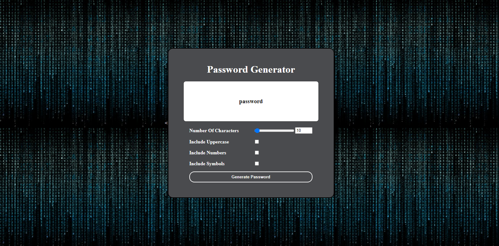

# My_Password_Generator
## Description
Homework 03-Javascript

Created a random password generator for greater security, utilizing numbers, upper and lowercase letters and symbols. 

[Website is published here](https://kstevenson84.github.io/My_Password_Generator/)

[Repository is contained here](https://github.com/kstevenson84/My_Password_Generator)

An image of the website is below:

Special thanks to Web Dev Simplified on YouTube for help with design. 